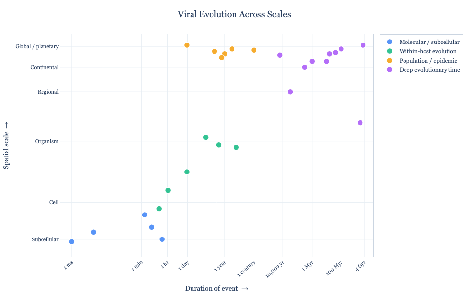

# Viral Evolution Spatiotemporal Scatter Plot

An interactive scatter plot that positions events in viral evolution on two
logarithmic axes: **time** (the duration over which the event operates) and
**space** (the physical scale at which it occurs). The result spans roughly 20
orders of magnitude on each axis — from a polymerase misincorporating a
nucleotide in milliseconds at the subcellular scale, to the conservation of a
capsid protein fold across four billion years of planetary history.

Heres's an example plot (click to open the interactive version):

[](https://VirologyCharite.github.io/viral-spatiotemporal-evolution-plot/index.html)

Intended for use as a visual for a class on viral evolution, though
the script is general enough to be adapted for any two-axis
logarithmic scatter plot driven by a config file.

Note: the code and this documentation were written by Claude code then
lightly edited.

---

## Files

| File | Purpose |
|---|---|
| `make-plot.py` | Python script that reads the TOML and produces the plot |
| `data.toml` | All data and styling — edit this to change the plot |

---

## Requirements

```
python >= 3.11
plotly >= 5.0
pytimeparse >= 1.1.8   # for human-readable time strings
kaleido # optional — only needed for PNG / PDF / SVG export
```

Install dependencies:

```bash
# Using pip
pip install plotly pytimeparse kaleido

# Using uv (recommended)
uv add plotly pytimeparse kaleido
```

---

## Usage

```bash
# Open the plot interactively in a browser window (default config file)
python make-plot.py

# Specify a different TOML file
python make-plot.py --config my_config.toml

# Save as a self-contained interactive HTML file
python make-plot.py -o plot.html

# Save as a static image (requires kaleido)
python make-plot.py -o plot.png
python make-plot.py -o plot.pdf
python make-plot.py -o plot.svg
```

The default config file is `data.toml` in the current directory. If
it is not found, the script will exit with an error message.

---

## Coordinate system

Both axes are logarithmic. X-axis values can be specified as either:
- **Numeric**: log₁₀ seconds (traditional format)  
- **String**: human-readable time expressions (new feature)

### X axis — duration of the event

**Option 1: Numeric values (log₁₀ seconds)**

| x value | Meaning |
|---|---|
| −3.0 | 1 millisecond |
| 1.78 | 1 minute |
| 3.56 | 1 hour |
| 4.94 | 1 day |
| 6.43 | 1 month |
| 7.50 | 1 year |
| 9.50 | 1 century |
| 11.50 | 10,000 years |
| 13.50 | 1 million years |
| 15.50 | 100 million years |
| 17.10 | ~4 billion years |

**Option 2: String values (human-readable time expressions)**

You can now use intuitive time strings instead of calculating log₁₀ values:

| Example strings | Equivalent numeric value |
|---|---|
| `"1 millisecond"`, `"1 ms"` | −3.0 |
| `"1 minute"` | 1.78 |
| `"1 hour"` | 3.56 |
| `"1 day"` | 4.94 |
| `"1 week"` | 5.78 |
| `"1 year"` | 7.50 |
| `"1 decade"` | 8.50 |
| `"1 century"` | 9.50 |
| `"10 Myr"` (10 million years) | 14.50 |
| `"4 Gyr"` (4 billion years) | 17.10 |

**Supported time units:**
- **Sub-second**: nanoseconds, microseconds, milliseconds (`"500 ns"`, `"10 μs"`, `"5 ms"`)
- **Standard**: seconds, minutes, hours, days, weeks (`"30 seconds"`, `"2 hours"`, `"3 weeks"`)  
- **Long-term**: years, decades, centuries, millennia (`"5 years"`, `"2 decades"`, `"3 millennia"`)
- **Geological**: million years (Myr), billion years (Gyr) (`"65 Myr"`, `"4.5 Gyr"`)

If a time string cannot be parsed, the script will print a warning and skip that data point.

### Y axis — spatial scale (log₁₀ metres)

| y value | Meaning |
|---|---|
| −8.0 | Subcellular (~10 nm, viral particle scale) |
| −5.0 | Cell (~10 µm) |
|  0.0 | Organism (~1 m) |
|  4.0 | Regional (~10 km) |
|  6.0 | Continental (~1,000 km) |
|  7.7 | Global / planetary |

---

## TOML configuration reference

The config file has five sections.

### `[plot]` — overall figure settings

```toml
[plot]
title                 = "Viral Evolution Across Scales"
width                 = 960          # pixels
height                = 620          # pixels
marker_size           = 12           # point diameter in pixels
marker_opacity        = 0.85         # 0.0 – 1.0
background_color      = "white"      # outer figure background
plot_background_color = "white"      # inner plot area background
hover_background      = "rgba(27,42,74,0.95)"
hover_text_color      = "white"
margin_left           = 90           # pixels
margin_right          = 40
margin_top            = 70
margin_bottom         = 95
```

### `[fonts]` — typography

```toml
[fonts]
family           = "Georgia, serif"  # CSS font-family string
title_size       = 18                # pt
axis_label_size  = 14
tick_size        = 11
legend_size      = 12
hover_size       = 12
hover_wrap_width = 55    # characters before wrapping hover description text
```

### `[axes]` — axis configuration

```toml
[axes]
x_label      = "Duration of event  →"
x_min        = -3.8         # left edge of x axis
x_max        = 17.7         # right edge of x axis
x_tick_angle = -40          # degrees; negative = counter-clockwise
y_label      = "Spatial scale  →"
y_min        = -9.4
y_max        =  8.7
y_tick_angle = 0
show_grid    = true
grid_color   = "#E8EEF4"
```

Tick marks are specified as arrays of `{value, label}` pairs. Add, remove, or
relabel ticks freely — only `value` (the log₁₀ position) and `label` (the
display string) are required:

```toml
[[axes.x_ticks]]
value = 7.50
label = "1 year"

[[axes.x_ticks]]
value = 9.50
label = "1 century"
```

The same pattern applies to `[[axes.y_ticks]]`.

### `[[categories]]` — legend groups

Each category defines a colour and a legend label. Points are assigned to
categories by matching the `id` string. Categories appear in the legend in the
order they are defined.

```toml
[[categories]]
id    = "molecular"
label = "Molecular / subcellular"
color = "#3B82F6"           # any CSS colour string

[[categories]]
id    = "epidemic"
label = "Population / epidemic"
color = "#F59E0B"
```

### `[[points]]` — data points

Each point is a TOML array-of-tables entry. `label`, `x`, `y`, and `category`
are required; `description` is optional but strongly recommended — it is the
text that appears in the hover tooltip.

**Example with numeric x value:**
```toml
[[points]]
label       = "Seasonal influenza antigenic drift"
x           = 7.5       # log10 seconds → ~1 year
y           = 7.1       # log10 metres  → global scale
category    = "epidemic"
description = "HA/NA accumulate mutations under antibody pressure over 1–2
years — enough to require annual vaccine reformulation globally."
```

**Example with string x value:**
```toml
[[points]]
label       = "Viral membrane budding"
x           = "2 minutes"    # human-readable time string
y           = -6.0           # log10 metres → cell scale
category    = "molecular"
description = "Enveloped viruses bud from the plasma membrane in minutes,
hijacking host ESCRT machinery."
```

**More string examples:**
```toml
[[points]]
label       = "Drug resistance emergence"
x           = "3 weeks"      # weeks to months timescale
y           = -0.3
category    = "within"

[[points]]
label       = "Ancient virus revival"
x           = "30000 years"  # can specify large numbers + unit
y           = 4.0
category    = "deep"

[[points]]
label       = "Geological timescale evolution"
x           = "50 Myr"       # geological notation supported
y           = 7.0
category    = "deep"
```

Points whose `category` value does not match any defined `[[categories]]` id
are silently ignored. Points with no `description` will show only the label in
the hover tooltip.

---

## Adding or editing points

Because all data lives in the TOML file, no Python knowledge is required to
customise the plot. To add a new point:

1. **Choose your time coordinate (x value):**
   - **Easy way**: Use a human-readable string like `"2 weeks"` or `"5 years"`  
   - **Traditional way**: Calculate log₁₀ seconds using the reference tables above
2. **Choose your spatial coordinate (y value):** log₁₀ metres using the reference table above
3. Append a `[[points]]` block anywhere in the file (order does not affect the plot)
4. Re-run the script

**Quick tip:** For x values, prefer human-readable strings — they're much more intuitive than calculating logarithms! For example:
- `x = "1 hour"` instead of `x = 3.56`  
- `x = "2 years"` instead of `x = 7.80`
- `x = "100 Myr"` instead of `x = 15.50`

To add a new category, append a `[[categories]]` block with a unique `id` and
a chosen colour, then use that `id` in any `[[points]]` entries.

---

## Output notes

**Interactive HTML** (`-o plot.html`) produces a fully self-contained file with
Plotly bundled via CDN reference. Hover over any point to read its description.
The legend is clickable — click a category to hide or show it; double-click to
isolate it.

**Static images** (`-o plot.png`, `.pdf`, `.svg`) require the `kaleido` package.
Kaleido uses a headless Chromium instance internally; on first run it may take a
few seconds longer than expected.

**Browser display** (no `-o` flag) opens a local server and launches the default
browser automatically via Plotly's built-in `fig.show()`.
